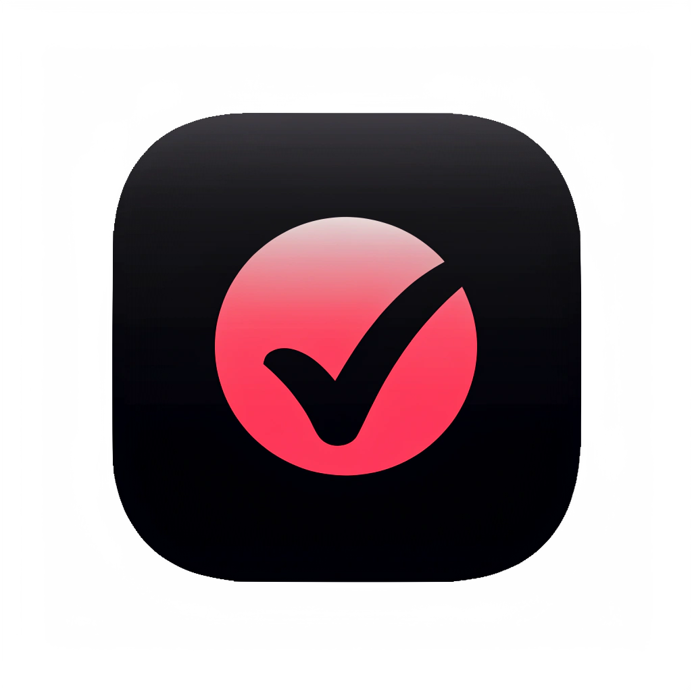
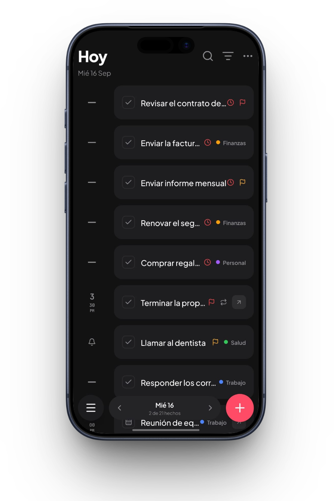
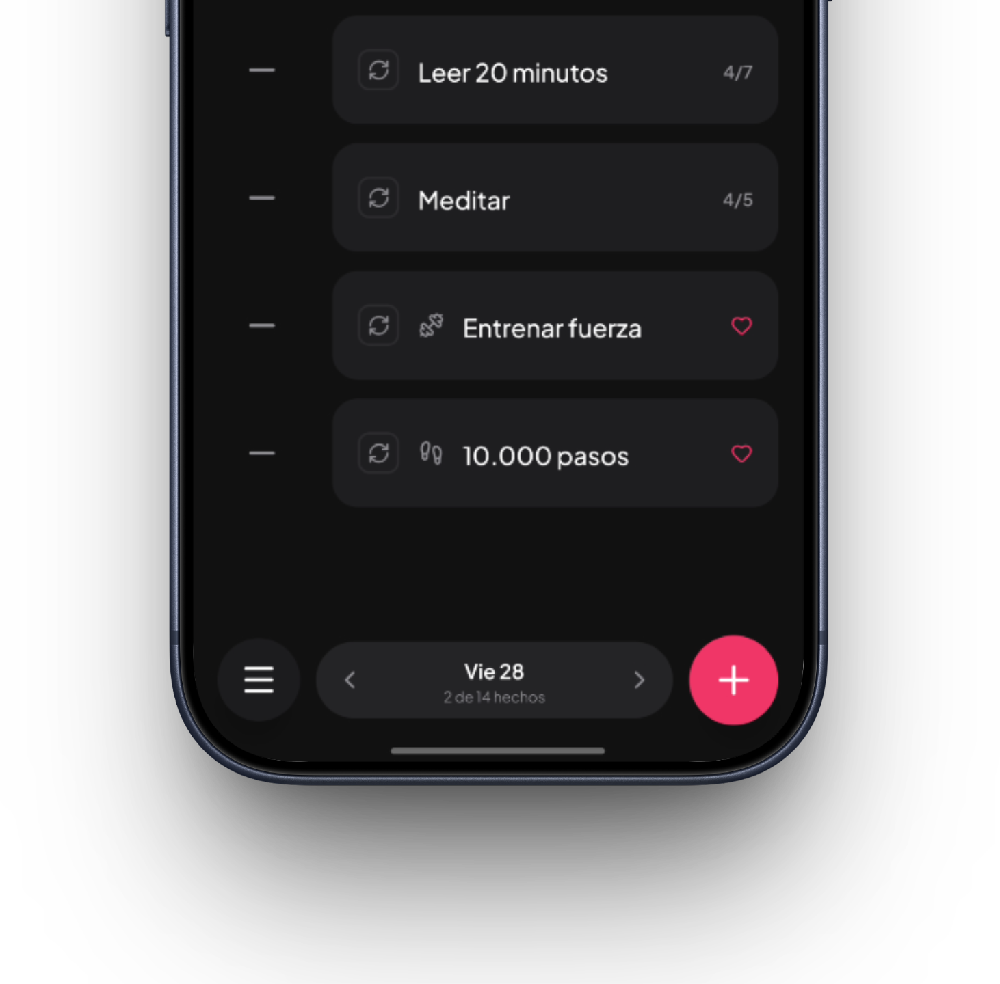
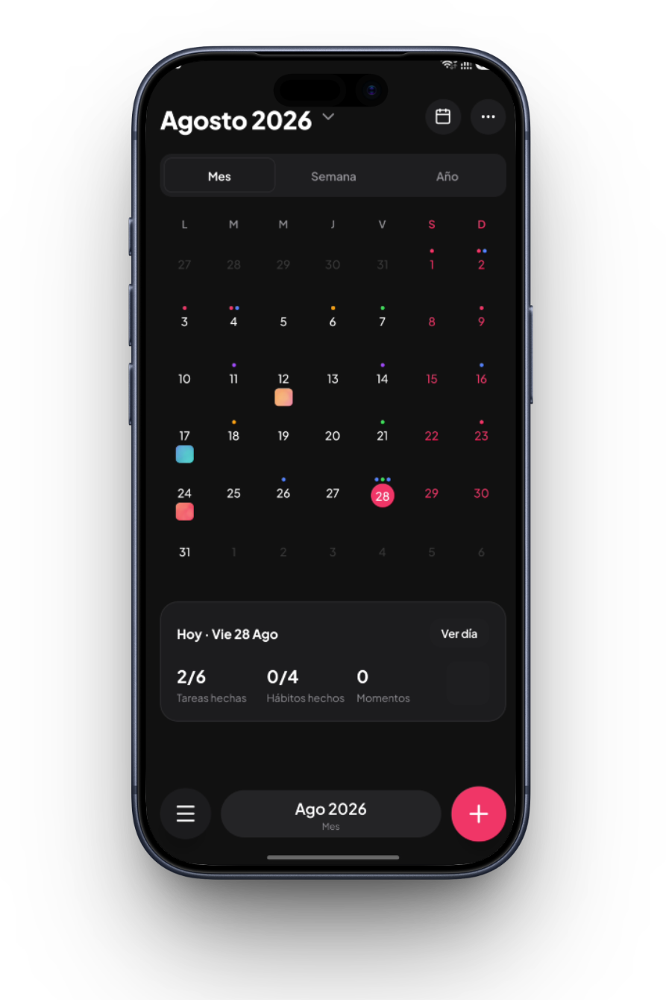

  

  # Meld

  **Tu día, en una sola vista.**

  Tareas, eventos, hábitos, notas, notas de voz y fotos — todo en un solo
  planificador diario. Sin conexión, sin cuenta, sin suscripción para lo
  esencial.

  
  
  
  

  <a href="https://usemeld.vercel.app"><strong>Prueba la demo en tu navegador →</strong></a>

 

  
  
  

## ¿Qué es Meld?

Organizar un día normal significa saltar entre una app de tareas, un
calendario, una app de hábitos, una de notas y la galería de fotos. Meld los
reúne a todos en una sola pantalla, ordenada por día.

- ✅ **Tareas** con hora, recordatorio, prioridad y categoría.
- 📅 **Eventos** con horario propio.
- 🔁 **Hábitos** con racha, progreso semanal y métricas de salud (pasos,
  sueño, entrenamientos…).
- 📝 **Notas** de texto.
- 🎙️ **Notas de voz** grabadas y reproducibles.
- 📸 **Momentos**: una foto por día para llevar un registro visual.

## Lo que hace diferente a Meld

- **Agregar por voz.** Dile "mañana a las 3pm llamar al dentista, prioridad
  alta" y Meld entiende el tipo de ítem, el día, la hora, la prioridad y la
  categoría — todo sin conexión a internet.
- **Local-first y privado.** El plan gratuito corre 100% en tu teléfono, en
  una base de datos local. No hay backend, no hay cuenta que crear y no hay
  que confiar tus datos a un servidor ajeno.
- **Vista por día, de verdad unificada.** No es un calendario con pestañas:
  es una sola lista ordenada por hora, agrupable por tipo, con búsqueda y
  recordatorios reales (notificaciones locales).
- **Widgets interactivos.** Marca tareas y hábitos como hechos desde la
  pantalla de inicio de Android, sin abrir la app.
- **Gratis para lo esencial, para siempre.** Meld Pro (sincronización en la
  nube, integración con salud, funciones con IA) es un complemento futuro,
  no un candado sobre lo que ya usas hoy.

## Pruébalo ahora mismo

No hace falta instalar nada: **[usemeld.vercel.app](https://usemeld.vercel.app)**
tiene una versión interactiva de la pantalla "Hoy" corriendo en el navegador
— agrega tareas, dicta por voz, complétalas, deslízalas para borrar. Ideal
para tener una idea real de cómo se siente la app antes de instalarla.

## Estado del proyecto

📱 **Próximamente en Google Play.** La app está en su fase final de pulido y
pruebas antes del lanzamiento público en Android. iOS está planeado para más
adelante.

¿Quieres que te avisemos el día del lanzamiento? Únete a la
[lista de espera](https://usemeld.vercel.app).

## Stack técnico

Construida con **Expo (React Native) + TypeScript**, `expo-sqlite` con
Drizzle ORM para persistencia 100% local, y `react-native-reanimated` para
las animaciones e interacciones (arrastrar, deslizar, gestos). La landing
está hecha en **Next.js**, desplegada en Vercel.

Este es un proyecto propietario en desarrollo activo — el repositorio no
acepta contribuciones externas por el momento, pero el código queda abierto
a la vista.

## Contacto

Desarrollado por **[Jonathan Blandon](https://github.com/JhonnyXT)**
([@Jhonny_devp](https://x.com/Jhonny_devp) en X).

¿Preguntas, feedback o ideas? Escríbeme por X o abre un
[issue](../../issues) en este repositorio.

## Licencia

Todos los derechos reservados. El código de este repositorio es privado y
no está licenciado para reutilización, redistribución o uso comercial de
terceros.
